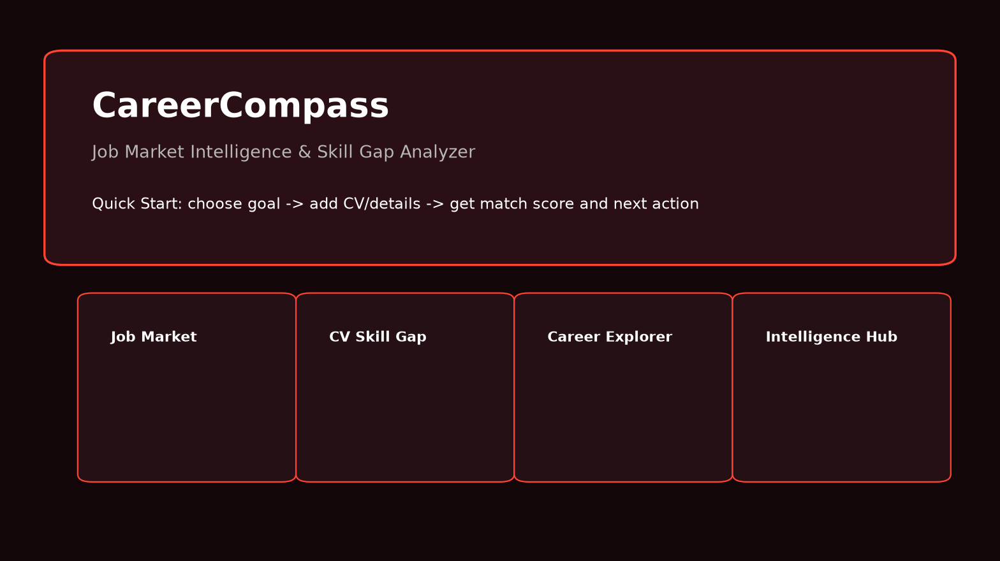
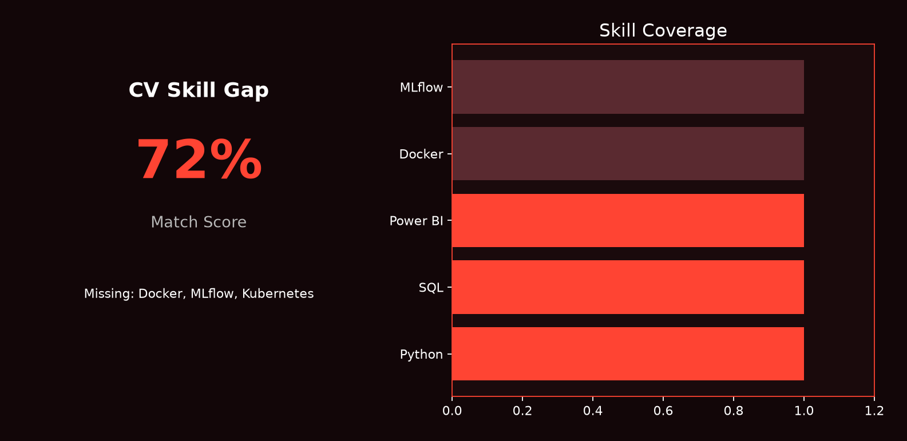
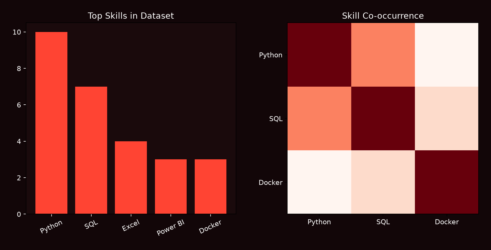
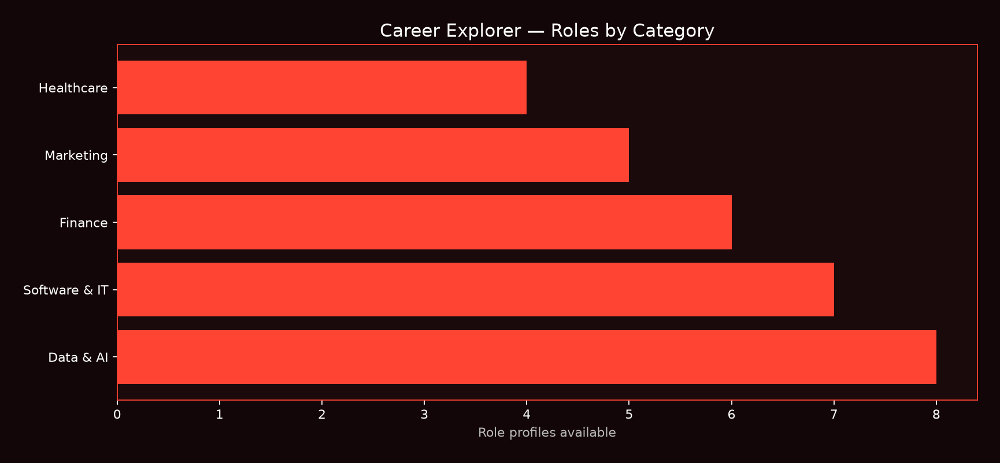

# CareerCompass

**Job Market Intelligence & Skill Gap Analyzer**


CareerCompass is a local-first, open-source career intelligence app. It turns job-post text and curated role profiles into clear guidance: market trends, skill gaps, project ideas, and next-step career actions.

No paid LLM APIs. Rule-based, transparent, and reproducible.

---

## Screenshots

| Landing & Quick Start | CV Skill Gap |
|:---:|:---:|
|  |  |

| Market Analytics | Career Explorer |
|:---:|:---:|
|  |  |

---

## What it does

- Analyzes job posts to surface in-demand skills and role patterns
- Compares your CV against market data or curated role profiles
- Scores job-description fit and highlights missing skills
- Recommends portfolio projects and career actions
- Works without job data through Career Explorer and category-based guidance

Two modes:

1. **Data-driven** — use sample, imported, or connector-fed job posts
2. **Category-driven** — use 12 curated career taxonomies when no job data is available

---

## Features

| Area | Capabilities |
|------|--------------|
| Data pipeline | CSV validation, cleaning, skill extraction, frequency tables |
| Market analytics | Overview KPIs, skill trends, co-occurrence, role clustering |
| Profile analysis | CV skill gap, job match score, regional profiles, synonym engine |
| Recommendations | Project templates, career action planner, learning resources |
| Career toolkit | Progress tracker, multi-CV compare, interview prep, resume bullets, badges |
| Intelligence hub | Company prep packs, salary bands, LinkedIn optimizer, peer benchmark, study calendar |
| Data import | CSV upload, expanded demo import, USAJobs connector (optional secrets) |
| Extras | PDF reports, English/Bengali UI, optional email digest, semantic matching |

**Career categories:** Data & AI, Software & IT, Banking & Finance, Business & Admin, Marketing & Sales, Design & Creative, Education & Teaching, Healthcare, Engineering, Customer Support, Operations & PM, Entry-Level.

---

## App pages

| # | Page | Purpose |
|---|------|---------|
| Home | `app/streamlit_app.py` | Quick Start wizard, module overview, dataset status |
| 1 | Job Market Overview | Role, company, location, and skill distributions |
| 2 | Skill Demand Analysis | Top skills, categories, co-occurrence, time-series |
| 3 | CV Skill Gap | Market or category-based gap analysis |
| 4 | Project & Career Actions | Project and action recommendations |
| 5 | Role Clustering | TF-IDF + KMeans job segmentation |
| 6 | Data Import | CSV upload, validation, USAJobs connector |
| 7 | Career Explorer | Browse roles and skills without job data |
| 8 | Job Match Dashboard | Paste job + CV for instant fit score |
| 9 | Career Toolkit | Progress, interview prep, resume bullets, badges |
| 10 | Career Intelligence Hub | Company prep, salary, LinkedIn, voice interview, ICS |

---

## Tech stack

Python · Pandas · NumPy · scikit-learn · Plotly · Streamlit · PyYAML · pytest

Optional: `sentence-transformers` for semantic skill matching.

---

## Quick start

### Fresh clone (recommended)

```powershell
git clone https://github.com/fzn011/AI-Job-Market-Intelligence-Skill-Gap-Recommender.git
cd AI-Job-Market-Intelligence-Skill-Gap-Recommender

Set-ExecutionPolicy -Scope CurrentUser RemoteSigned
.\setup.ps1 -RunApp
```

After the first setup:

```powershell
.\run_app.ps1
```

Lightweight install (skips heavy ML packages):

```powershell
.\setup.ps1 -SkipHeavyPackages -RunApp
```

### Linux / macOS

```bash
git clone https://github.com/fzn011/AI-Job-Market-Intelligence-Skill-Gap-Recommender.git
cd AI-Job-Market-Intelligence-Skill-Gap-Recommender

python3 -m venv .venv
source .venv/bin/activate
pip install -r requirements.txt

python3 scripts/generate_career_taxonomies.py
python3 scripts/generate_advanced_features_data.py
python3 scripts/generate_premium_features_data.py
python3 scripts/run_project_check.py

python3 -m streamlit run app/streamlit_app.py
```

Open: [http://localhost:8501](http://localhost:8501)

### If something breaks after an upgrade

```powershell
git fetch origin main
git reset --hard origin/main
python scripts/emergency_repair.py
.\run_app.ps1
```

---

## Architecture

```text
CSV / Demo Jobs ──► Clean & Validate ──► Skill Extraction ──► Analytics Pages
                                              │
Career Taxonomies ──► Role Profiles ──► CV Gap / Actions / Explorer
```

Details: [docs/architecture.md](docs/architecture.md)

---

## Import job data

Guide: [docs/job_data_import_guide.md](docs/job_data_import_guide.md)

```bash
python3 scripts/import_jobs_from_csv.py --demo expanded
python3 scripts/import_jobs_from_csv.py --input data/raw/my_jobs.csv
```

USAJobs (optional): copy `.streamlit/secrets.example.toml` to `.streamlit/secrets.toml` and add your API key.

---

## Commands

```bash
python3 scripts/run_project_check.py      # health check
python3 scripts/emergency_repair.py       # fix outdated local files
python3 scripts/final_project_audit.py    # full audit
python3 -m pytest tests/ -q               # run tests
python3 -m streamlit run app/streamlit_app.py
```

---

## Testing

150 automated tests cover cleaning, extraction, recommendations, clustering, imports, taxonomies, and startup verification.

```bash
python3 -m pytest tests/ -q
```

---

## Limitations

- Default job data is synthetic unless you import your own CSV
- Role profiles are curated simplifications, not live hiring data
- Skill extraction is dictionary-based and rule-driven
- Results are decision support, not hiring guarantees

Full notes: [docs/limitations.md](docs/limitations.md)

---

## Documentation

- [Recruiter one-pager](docs/recruiter_one_pager.md)
- [Demo script](docs/demo/demo_script.md)
- [Portfolio summary](docs/portfolio_summary.md)
- [Screenshot checklist](docs/screenshots/screenshot_checklist.md)

---

## Author

**Faiaz Zahin**

- Portfolio: [https://fzn011.github.io/portfolio/](https://fzn011.github.io/portfolio/)
- GitHub: [@fzn011](https://github.com/fzn011)

---

© 2026 Faiaz Zahin. All rights reserved.
